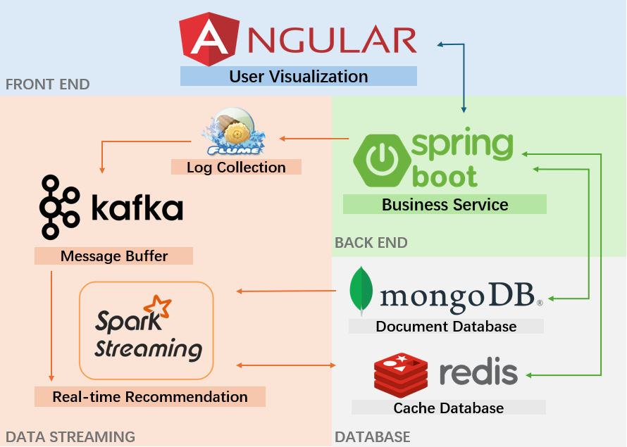
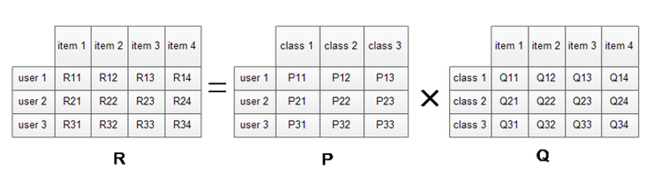
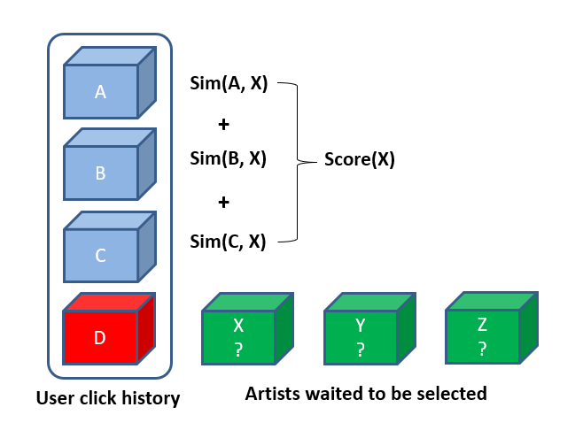
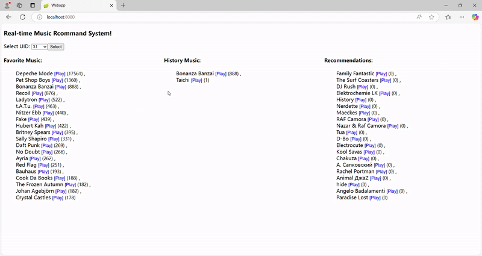

### Introduction
This is the final project for course on Big Data Systems. 

[](./static/paper.pdf)

This project implements a real-time music recommendation system based on a user behavior dataset from Last.fm website. The major function of this system is to update the recommendation result in real time according to the user's behavior. This project uses a series of big data tools to either build the data pipeline or design the recommendation algorithm, so that the project has the scalability to expand to distributed systems and process large-scale streaming data.

<div style="text-align: center;">
  
</div>

### Streaming Data Pipeline
This project adopts a series of big Data tools to build a Data pipeline, so that the project has the foundation to expand to the scale of big data. Among them, Flume-ng serves as a data acquisition tool, Kafka serves as a message cache, Spark Streaming serves as a real-time processing engine, and MongoDB serves as a storage of calculation results. A log generated by a user's operation will be passed to the spark streaming as Streaming Data through the pipeline, triggering the recommendation algorithm, which will calculate an updated list of recommended musicians according to the user's latest operation, which realized the real-time recommendation.

### Recommendation Algorithm
#### Step 1: Get Artist Similarity Matrix from Latent Factor Model (LFM)
The dataset provides how many times each user has listened to different musicians, and the core of the Latent Factor Model (LFM) algorithm is that the user's behavior information contains information about user similarity and musician similarity. The user-click matrix can be decomposed into the product of user-implicit feature matrix and implicit feature-musician matrix. By calculating the similarity between those hidden features from musicians, we can get the artist similarity matrix, which can be used for the real-time recommendation algorithm.

<div style="text-align: center;">
  
</div>

#### Step 2: Real-time Recommendation Algorithm
The core of the real-time recommendation algorithm is:the preferences of users in the most recent period of time are similar. Assume that `mid` is the artist id which the user clicked to trigger the algorithm, the specific algorithm is as follows:
1. `smids` is a set of musicians most similar to `mid` obtained from Artist Similarity Matrix;
2. Get 10 musicians recently clicked by the user from redis to form `hmids`;
3. Calculate the similarity of each item in `smids` with `mid` and each item in `hmids` with `mid`, and sum them according to different weights as score.
4. Reorder `smids` by similarity score to return the top 20 musicians;

<div style="text-align: center;">
  
</div>

### Database
This project uses different NoSQL databases to store data according to the characteristics of the data. User behavior data is stored in MongoDB, and user click history is stored in Redis.

### Web Application
The project also developed a Web application through which users can operate and view music recommendation results. The Web application uses the Angular framework for the front end, the Spring Boot framework for the back end, and the front and back end interact with Restful APIs.

<div style="text-align: center;">
  
</div>

### Deployment and Furture Work
The project is currently deployed locally with dockers and will be deployed to the AWS cloud in the future.

## How to run the project

### 1. Start the Redis, Kafka and Flume （Docker Contain）
under the root directory of the project, run the following commands:
```
docker build -t my-kafka-flume .

docker run -d
  --name recommender-container
  -v D:\Personal_Experience\music_recommender\back_end\src\main\log\agent.log:/log/agent.log
  -p 2181:2181
  -p 9092:9092
  -p 6379:6379
  -p 11000:11000
  my-kafka-flume
```
How to test
```
apt-get install net-tools
# check zookeeper
/opt/zookeeper/bin/zkServer.sh status

# check redis
open redis-cli on localhost and redis-cli on docker, check the ping

# check kafka
/opt/kafka/bin/kafka-topics.sh --list --bootstrap-server localhost:9092
$KAFKA_HOME/bin/kafka-console-consumer.sh --bootstrap-server localhost:9092 --topic MusicRecommender --from-beginning

# check flume
check the flume log file

# how to restart the services
ps aux | grep flume
kill -9 <pid>
```

### 2. Start the Backend
```
cd back_end
mvn clean spring-boot:run
```
How to check
```
mvn clean install -U
mvn -Dtest=RedisConnectionTest test
```

### 3. Start the Frontend
```
cd front_end
ng serve
```

### 4. Run Data Processing
```
cd data_processing
sbt compile
sbt run 
```

### 5. Deploy the project to AWS
```
java -jar target\scala-2.11\StreamingRecommender-assembly-1.0.jar

scp -i C:\Users\garbon\.ssh\recommender.pem D:\javacode\MusicRecommender\back_end\target\back_end-0.0.1-SNAPSHOT.jar ubuntu@ec2-54-162-93-42.compute-1.amazonaws.com:/home/ubuntu

still working on it... 
```